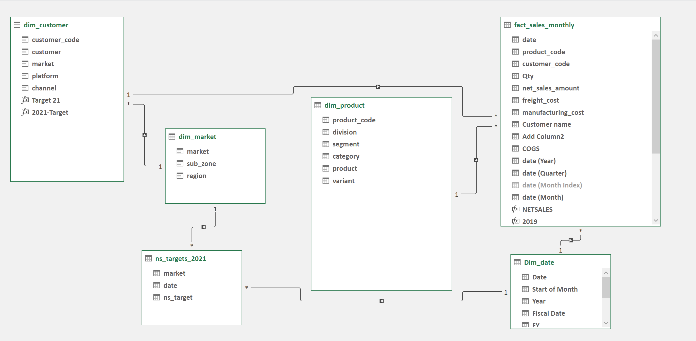

# 📊 Customer Sales & Market Performance Analytics


---

## 📌 Project Overview

This project analyzes **customer sales growth** and **market performance** using **advanced Excel BI features**.
It evaluates net sales trends, target achievement, and profitability metrics across **customers, markets, and products** from **2019–2021**.

📈 Built to support **data-driven business decisions** through clear, actionable insights.

---

## 📂 Table of Contents

* [Business Problem](#-business-problem)
* [Key Metrics & KPIs](#-key-metrics--kpis)
* [Tools & Technologies](#-tools--technologies)
* [Data Modeling](#-data-modeling)
* [Project Structure](#-project-structure)
* [Key Insights](#-key-insights)
* [Report Snapshots](#-report-snapshots)
* [How to Use This Project](#-how-to-use-this-project)
* [Final Recommendations](#-final-recommendations)

---

## 🎯 Business Problem

The analysis aims to:

* Identify **top-growing customers** and revenue drivers
* Measure **market performance vs targets**
* Compare **profitability across regions**
* Highlight **fastest-growing products** for strategic investment

---

## 📌 Key Metrics & KPIs

* **Net Sales**
* **Gross Margin (GM) & GM%**
* **COGS**
* **YoY Growth %**
* **Target Achievement %**
* **Quarterly & Yearly Trends**

---

## 🛠 Tools & Technologies

| Tool                | Purpose                         |
| ------------------- | ------------------------------- |
| **Microsoft Excel** | End-to-end analysis & reporting |
| **Power Query**     | Data cleaning & transformation  |
| **Power Pivot**     | Data modeling & relationships   |
| **Pivot Tables**    | Aggregation & slicing           |
| **DAX**             | KPI calculations                |
| **Date Table**      | Time-intelligence analysis      |

---

## 🧩 Data Modeling

* Star schema design
* Fact table: `fact_sales_monthly`
* Dimension tables:

  * Customer
  * Market
  * Product
  * Date

📷 **Data Model Screenshot**



---

## 📁 Project Structure

```
Customer-Sales-Market-Performance/
│
├─ Reports/
│  ├─ Customer_Net_Sales_Performance.pdf
│  ├─ Market Performance vs Target.pdf
│  ├─ P & L For Markets.pdf
│  ├─ P & L by Fiscal Year 1.pdf
│  └─ Top 10 Products.pdf
│
├─ Data_Model_Screenshot.png
└─ README.md
```

---

## 🔍 Key Insights

### 📈 Sales Growth

* Net Sales grew rapidly:

  * **$87.5M (2019)**
  * **$196.7M (2020)**
  * **$598.9M (2021)**

### 👥 Customer Performance

* Strong growth from:

  * *AtliQ eStore*
  * *Amazon*
  * *Flipkart*
  * *BestBuy*
  * *AtliQ Exclusive*

### 🌍 Market Performance

* Overall **~9% gap** vs 2021 sales targets
* High-margin markets:

  * **New Zealand (48.2% GM)**
  * **Japan (46.5% GM)**
* Low-margin market:

  * **Germany (26.2% GM)**

### 🚀 Product Growth (2021 vs 2020)

* *AQ Mx NB* → **+5723%**
* *AQ Smash 2* → **+2589%**
* *AQ LION X Series* → **1700%+**
* **Top 10 products delivered 808% YoY growth**

---

## 📑 Report Snapshots

| Report                 | Description                      |
| ---------------------- | -------------------------------- |
| **Customer Net Sales** | Customer-wise growth (2019–2021) |
| **Market vs Target**   | Actual vs target analysis        |
| **P&L by Market**      | Profitability comparison         |
| **P&L by Fiscal Year** | Yearly & quarterly trends        |
| **Top 10 Products**    | Fastest-growing products         |

📂 Access all reports here → [`Reports/`](Reports)

---

## ▶️ How to Use This Project

1. Navigate to the **Reports** folder
2. Review PDFs in the following order:

   * Customer Net Sales Performance
   * Market Performance vs Target
   * P&L for Markets
   * P&L by Fiscal Year
   * Top 10 Products

---

## ✅ Final Recommendations

* Double down on **high-value customers** like Amazon & AtliQ Exclusive
* Address **target gaps** in large markets (USA, India, Canada)
* Replicate **high-margin strategies** from Japan & New Zealand
* Improve margins in **underperforming markets** (Germany, Norway)
* Invest further in **high-growth products** to sustain momentum
* Track performance **quarterly** for proactive decision-making

---

### ⭐ If you find this project useful, consider giving it a star!


